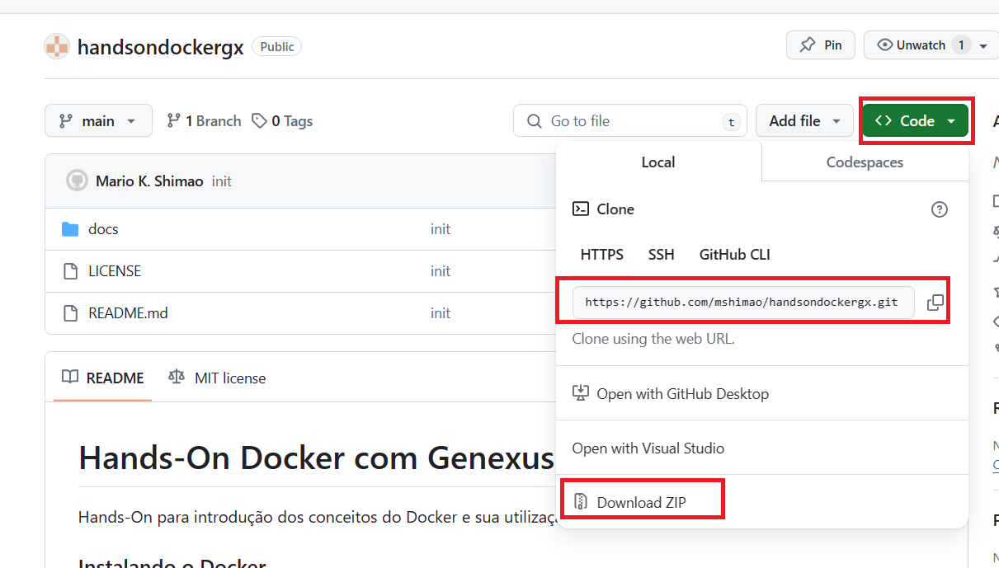

# Hands-On Docker com Genexus

Hands-On para introdução dos conceitos do Docker e sua utilização com o Genexus.

### Requisitos

Inicialmente é necessário configurar os requisitos para trabalharmos com o Grafana.

Os requisitos são:
- Docker Desktop for Windows
- Genexus 18
- Gerador .NET Core (https://wiki.genexus.com/commwiki/wiki?38605,.NET+Generator+Requirements)
- SQL Server 2016 ou superior

### Instalação do Docker Desktop for Windows

O primeiro passo é ler a documentação do Docker que explica os requisitos para a instalação do Docker Desktop for Windows:

- [Requisitos para o Docker Desktop for Windows](https://docs.docker.com/desktop/install/windows-install/#system-requirements)

Após a leitura e configuração dos requisitos, agora é fazer o download do Docker Desktop for Windows e a instalação.

- [Instalar o Docker Desktop for Windows](https://docs.docker.com/desktop/install/windows-install/#install-docker-desktop-on-windows)

Com isso temos o ambiente preparado para executar os contêineres Docker.

### Copiar os arquivos do hands-on

Para prosseguir será necessário copiar os arquivos do hands-on, para isso, realizar o clone do repositório git ou o download do zip.

### Criar um KB Genexus 

Criar uma KB com o environment .NET Core.

Com a KB criada, importar o arquivo xpz `HandsOnDocker.xpz` que está na pasta `genexus/HandsOnDocker.xpz` arquivos do git que foram baixados. 

Crie a base de dados SQL Server para os dados utilizando o IP da sua máquina no campo Server Name, isso é necessário para que o container docker possa acessar o SQL Server.

Outro item importante, configure seu SQL Server para utilizar login com um usuário SQL e configure a conexão da aplicação utilizando um usuário e senha do SQL.

Isso é necessário porque não é possível realizar a conexão a base de dados a partir do container usando Trusted Connection.

Gere a aplicação no Genexus e rode a aplicação para ver ser tudo está ok.

Agora todos os requisitos para a realização do hands estão prontos.

Próximo: [Atividade 01](docs/01-atividade.md)