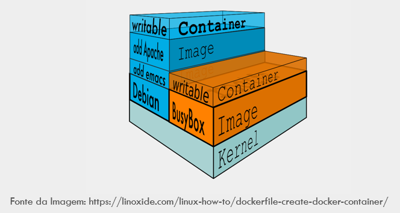

# Atividade 01

## Docker

Docker é uma tecnologia de software que fornece contêineres, promovido pela empresa Docker, Inc. O Docker fornece uma camada adicional de abstração e automação de virtualização de nível de sistema operacional no Windows e no Linux.

## VM x Docker

Vamos comparar Docker e Máquinas Virtuais (VMs). Ambos são usados para criar ambientes isolados, mas têm diferenças importantes:

Virtual Machines (VMs):
- Funcionamento: Uma VM é a emulação de um computador físico dentro de uma máquina hospedeira. Cada VM tem seu próprio sistema operacional convidado.
- Isolamento: As VMs virtualizam tanto o sistema operacional quanto o kernel, proporcionando um alto nível de isolamento.
- Overhead: As VMs têm um overhead maior, pois precisam executar um sistema operacional completo para cada instância.
- Uso de Recursos: Requer mais recursos de computação (CPU, memória) devido à virtualização completa.
Cenários: Ótimo para aplicativos legados ou quando é necessário isolamento rígido entre instâncias.

Docker Containers: 
- Funcionamento: Os containers Docker são unidades portáteis de software que incluem o aplicativo, suas dependências e configurações.
- Isolamento: Não inicializam seu próprio sistema operacional convidado. Em vez disso, executam sobre o sistema operacional hospedeiro.
- Overhead: Baixo overhead, pois compartilham o kernel do host.
- Uso de Recursos: Requer menos recursos, inicia mais rapidamente e é menos intensivo em recursos.
- Cenários: Ideal para aplicativos modernos, microservices e implantações rápidas.

Em resumo, VMs oferecem isolamento forte, enquanto os containers Docker são mais eficientes em termos de recursos e escalabilidade. A escolha depende das necessidades específicas de sua aplicação.


## Arquitetura

A arquitetura do Docker de forma simplificada:

- Cliente e Servidor: O Docker utiliza uma arquitetura cliente-servidor. O cliente é a interface de linha de comando (CLI) que você usa para interagir com o Docker. O servidor é o daemon do Docker, que gerencia os contêineres e imagens.
O cliente e o daemon se comunicam por meio de uma API REST.
- Daemon do Docker: O daemon é o coração do Docker. Ele gerencia os contêineres, imagens, redes, volumes e outros objetos.
O daemon escuta solicitações do cliente e executa as operações necessárias.
- Imagens: Uma imagem é um pacote leve e independente que contém tudo o que é necessário para executar um aplicativo.
As imagens são criadas a partir de um Dockerfile, que especifica as instruções para construir a imagem.
- Redes e Volumes: Redes permitem que os contêineres se comuniquem entre si ou com o mundo exterior.
Volumes são usados para persistir dados entre os ciclos de vida dos contêineres.
- Registro: O registro é um serviço que armazena e distribui imagens do Docker.
O Docker Hub é um registro público amplamente utilizado, mas você também pode usar registros privados.


### Imagem Docker

Imagine que você está criando um bolo. A imagem Docker é a receita desse bolo. Ela contém todas as instruções necessárias para montar o bolo, como os ingredientes, o tempo de cozimento e a temperatura do forno.
No caso do Docker, a imagem inclui todo o código-fonte ou binários, dependências e configurações necessárias para executar um aplicativo ou serviço.
As imagens são apenas de leitura e não podem ser modificadas. Elas são armazenadas no Docker Hub ou em um outro registry de imagens (semelhante ao GitHub, mas para imagens Docker).
Imagens Docker são compostas por sistemas de arquivos de camadas que ficam uma sobre as outras.



Uma imagem pode ser usada como base para a criação de uma nova imagem, veremos mais adiante como isso é feito.


### Container

Agora, pense no contêiner como o bolo pronto. Ele é criado a partir da imagem e representa uma instância em execução do aplicativo ou serviço.
Quando você executa o comando docker run, está criando um novo contêiner com base na imagem. O contêiner é onde o aplicativo ou serviço realmente roda.
Os contêineres são modificáveis e podem ser iniciados, parados, reiniciados e excluídos.

### Registry

O Registry é como um repositório de imagens Docker, o mais conhecido é o Docker Hub. Lá, você encontra imagens prontas para uso, como imagens oficiais de serviços populares.
Você pode pesquisar por imagens no Docker Hub usando o comando docker search.
Também é possível criar suas próprias imagens e compartilhá-las no Docker Hub.
Os provedores de serviços de nuvem oferecem instâncias de registry para serem utilizados em projetos privados, por exemplo o Azure oferece o Azure Container Registry.

## Motivos para a usar o Docker

Principais motivações para a utilização do Docker:
- Isolamento e Portabilidade:
    - O Docker permite empacotar um aplicativo e suas dependências em um container isolado. Isso significa que você pode executar o mesmo container em diferentes ambientes (desenvolvimento, teste, produção) sem preocupações com divergências.
    - A portabilidade é fundamental: você pode criar um container no seu laptop e implantá-lo em servidores, nuvens públicas ou privadas.
- Eficiência e Recursos:
    - Os containers são leves e compartilham o mesmo kernel do sistema operacional. Isso economiza recursos em comparação com máquinas virtuais tradicionais, que exigem um sistema operacional completo para cada instância.
    - Os containers consomem menos espaço em disco e inicializam mais rapidamente.
- Gerenciamento Simplificado:
    - Com o Docker, você pode gerenciar facilmente vários containers usando comandos simples. Iniciar, parar, reiniciar e escalar aplicativos é mais fácil.
    - O Docker Compose permite definir aplicativos multi-container em um único arquivo YAML.
- Reprodutibilidade e Consistência:
    - A criação de imagens Docker é baseada em arquivos de configuração (Dockerfile). Isso garante que todos os membros da equipe usem a mesma base para construir e executar aplicativos.
    - Evita o famoso problema do “Na minha máquina funciona!”.
- Passo inicial para implantação no Kubernetes:
    - Como o Kubernetes faz a orquestração de containeres, é essencial que sua aplicação esteja em imagens para que seja possível implantá-la no Kubernetes.

### Container Linux ou Windows

Hoje existe a possibilidade de executar conteineres Windows, mas na prática, a maioria dos sistemas rodam em conteineres Linux, por questão de custo e performance.
Talvez o único caso indicado para a utilização de conteineres Windows seria a necessidade de rodar um aplicação legada.

## hello-world

Nesta atividade e nas próximas utilizaremos o docker CLI para executar as atividades e não a interface gráfica do Docker Desktop. O motivo disso é que na maioria das situações em produção ou nos ambientes de provedores de nuvem, será necessário executar os comandos utilizando o CLI, pois o Docker Desktop não estará disponível.

#### Passo 1

Neste primeiro exercicio vamos fazer o conhecido hello-world. Para isso abra um tela de linha comando e execute o comando `docker run hello-world`.

```bash
C:\> docker run hello-world
Unable to find image 'hello-world:latest' locally
latest: Pulling from library/hello-world
1b930d010525: Pull complete
Digest: sha256:41a65640635299bab090f783209c1e3a3f11934cf7756b09cb2f1e02147c6ed8
Status: Downloaded newer image for hello-world:latest

Hello from Docker!
This message shows that your installation appears to be working correctly.
...
```
Ao executar esse comando, o Docker irá verificar que se a imagem existe no nosso computador, não existindo a imagem, ele executa o download da imagem do Docker Hub e inicia o contêiner.

#### Passo 2

Se executarmos o comando [docker ps](https://docs.docker.com/engine/reference/commandline/ps/) serão listados os contêineres.

```bash
C:\>docker ps
CONTAINER ID        IMAGE               COMMAND             CREATED             STATUS              PORTS           NAMES
```

Veja que não existe nenhum contêiner rodando, vamos executar uma variação do comando ps e ver o que acontece. Execute o comando `docker ps -a`.

```bash
c:\>docker ps -a
CONTAINER ID        IMAGE               COMMAND             CREATED             STATUS                         PORTS               NAMES
30567b2dd8d4        hello-world         "/hello"            About an hour ago   Exited (0) About an hour ago                       trusting_jackson
```

Na lista apareceu o contêiner que foi executado e agora está parado.

Próximo: [Atividade 02](02-atividade.md)