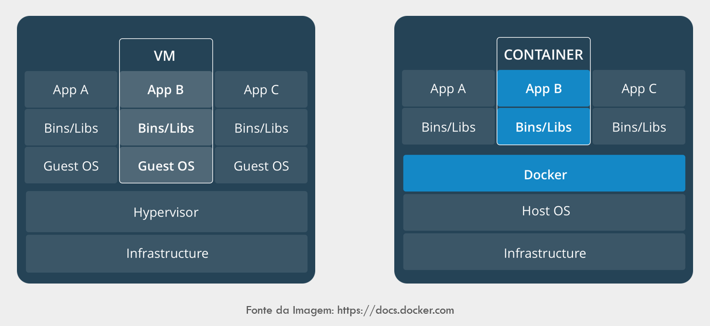
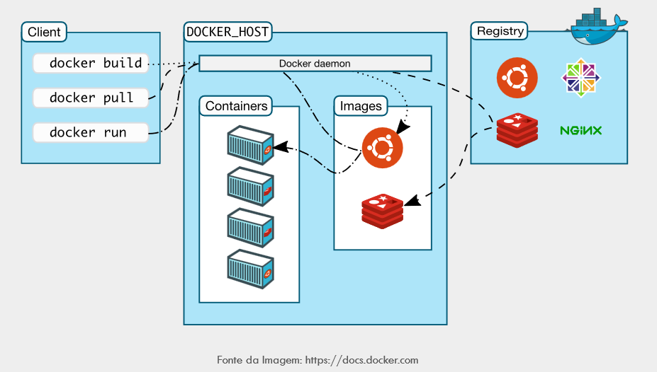

# Atividade 01

## Docker

Docker é uma tecnologia de software que fornece contêineres, promovido pela empresa Docker, Inc. O Docker fornece uma camada adicional de abstração e automação de virtualização de nível de sistema operacional no Windows e no Linux.

## VM x Docker

Vamos comparar Docker e Máquinas Virtuais (VMs). Ambos são usados para criar ambientes isolados, mas têm diferenças importantes:

Virtual Machines (VMs):
- Funcionamento: Uma VM é a emulação de um computador físico dentro de uma máquina hospedeira. Cada VM tem seu próprio sistema operacional convidado.
- Isolamento: As VMs virtualizam tanto o sistema operacional quanto o kernel, proporcionando um alto nível de isolamento.
- Overhead: As VMs têm um overhead maior, pois precisam executar um sistema operacional completo para cada instância.
- Uso de Recursos: Requer mais recursos de computação (CPU, memória) devido à virtualização completa.
Cenários: Ótimo para aplicativos legados ou quando é necessário isolamento rígido entre instâncias.

Docker Containers: 
- Funcionamento: Os containers Docker são unidades portáteis de software que incluem o aplicativo, suas dependências e configurações.
- Isolamento: Não inicializam seu próprio sistema operacional convidado. Em vez disso, executam sobre o sistema operacional hospedeiro.
- Overhead: Baixo overhead, pois compartilham o kernel do host.
- Uso de Recursos: Requer menos recursos, inicia mais rapidamente e é menos intensivo em recursos.
- Cenários: Ideal para aplicativos modernos, microservices e implantações rápidas.

Em resumo, VMs oferecem isolamento forte, enquanto os containers Docker são mais eficientes em termos de recursos e escalabilidade. A escolha depende das necessidades específicas de sua aplicação.



## Arquitetura

A arquitetura do Docker de forma simplificada:

- Cliente e Servidor: O Docker utiliza uma arquitetura cliente-servidor. O cliente é a interface de linha de comando (CLI) que você usa para interagir com o Docker. O servidor é o daemon do Docker, que gerencia os contêineres e imagens.
O cliente e o daemon se comunicam por meio de uma API REST.
- Daemon do Docker: O daemon é o coração do Docker. Ele gerencia os contêineres, imagens, redes, volumes e outros objetos.
O daemon escuta solicitações do cliente e executa as operações necessárias.
- Imagens: Uma imagem é um pacote leve e independente que contém tudo o que é necessário para executar um aplicativo.
As imagens são criadas a partir de um Dockerfile, que especifica as instruções para construir a imagem.
- Redes e Volumes: Redes permitem que os contêineres se comuniquem entre si ou com o mundo exterior.
Volumes são usados para persistir dados entre os ciclos de vida dos contêineres.
- Registro: O registro é um serviço que armazena e distribui imagens do Docker.
O Docker Hub é um registro público amplamente utilizado, mas você também pode usar registros privados.



## hello-world

#### Passo 1

Neste primeiro exercicio vamos fazer o conhecido hello-world. Para isso abra um tela de linha comando e execute o comando `docker run hello-world`.

```bash
C:\> docker run hello-world
Unable to find image 'hello-world:latest' locally
latest: Pulling from library/hello-world
1b930d010525: Pull complete
Digest: sha256:41a65640635299bab090f783209c1e3a3f11934cf7756b09cb2f1e02147c6ed8
Status: Downloaded newer image for hello-world:latest

Hello from Docker!
This message shows that your installation appears to be working correctly.
...
```
Ao executar esse comando, o Docker irá verificar que se a imagem existe no nosso computador, não existindo a imagem, ele executa o download da imagem do Docker Hub e inicia o contêiner.

#### Passo 2

Se executarmos o comando [docker ps](https://docs.docker.com/engine/reference/commandline/ps/) serão listados os contêineres.

```bash
C:\>docker ps
CONTAINER ID        IMAGE               COMMAND             CREATED             STATUS              PORTS           NAMES
```

Veja que não existe nenhum contêiner rodando, vamos executar uma variação do comando ps e ver o que acontece. Execute o comando `docker ps -a`.

```bash
c:\>docker ps -a
CONTAINER ID        IMAGE               COMMAND             CREATED             STATUS                         PORTS               NAMES
30567b2dd8d4        hello-world         "/hello"            About an hour ago   Exited (0) About an hour ago                       trusting_jackson
```

Na lista apareceu o contêiner que foi executado e agora está parado.

Próximo: [Atividade 02](02-atividade.md)