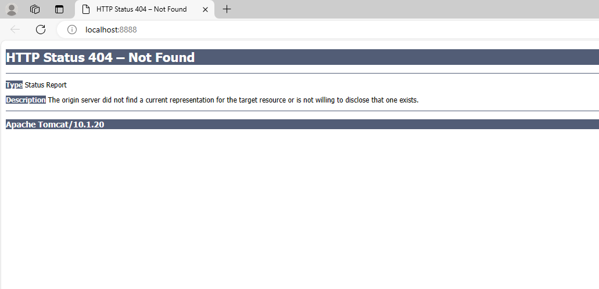

# Atividade 02

## Docker CLI

Nesta atividade vamos explorar alguns comandos básicos do Docker CLI, inicialmente vamos executar o comando [docker pull](https://docs.docker.com/engine/reference/commandline/pull/) para realizar o download da imagem para o computador. Para isso iremos executar o comando `docker pull tomcat`.

```bash
C:\>docker pull tomcat
Using default tag: latest
latest: Pulling from library/tomcat
6f2f362378c5: Pull complete
494c27a8a6b8: Pull complete
7596bb83081b: Pull complete
372744b62d49: Pull complete
fb72767f9beb: Pull complete
3fe571af508a: Pull complete
3e6725074325: Pull complete
9ffd5dadda90: Pull complete
4e051c2969b0: Pull complete
b326a8316680: Pull complete
Digest: sha256:cea26a23e1ebdbebdddde1e02a10e655b0b386d8de6002301a037a08be87a12f
Status: Downloaded newer image for tomcat:latest
```

O Docker irá realizar o download da imagem do Tomcat para o computador e descompactar a imagem. 

Para listar as imagens que existem localmente existe o comando [docker images](https://docs.docker.com/engine/reference/commandline/images/), execute ele na linha de comando.

```bash
C:\>docker images
REPOSITORY          TAG                 IMAGE ID            CREATED             SIZE
tomcat              latest              5377fd8533c3        2 weeks ago         506MB
hello-world         latest              fce289e99eb9        6 months ago        1.84kB
```
São apresentados todas as imagens que foram baixadas para o computador.

Para executar um contêiner existe o comando [docker run](https://docs.docker.com/engine/reference/commandline/run/), vamos executar a imagem do Tomcat com o a comando `docker run -it -p 8888:8080 tomcat`. O parâmetro `-it` faz o contêiner executar em modo interativo e o parâmetro `-p`  faz o mapeamento da porta do contêiner em uma porta no host, neste caso mapeando a porta 8080 do contêiner para a porta 8888 do computador, dessa forma o Tomcat estará visivel pela porta 8888. 

```bash
c:\>docker run -it -p 8888:8080 tomcat
Using CATALINA_BASE:   /usr/local/tomcat
Using CATALINA_HOME:   /usr/local/tomcat
Using CATALINA_TMPDIR: /usr/local/tomcat/temp
Using JRE_HOME:        /usr/local/openjdk-8
Using CLASSPATH:       /usr/local/tomcat/bin/bootstrap.jar:/usr/local/tomcat/bin/tomcat-juli.jar
30-Jun-2019 15:33:14.479 INFO [main] org.apache.catalina.startup.VersionLoggerListener.log Server version:        Apache Tomcat/8.5.42
30-Jun-2019 15:33:14.482 INFO [main] org.apache.catalina.startup.VersionLoggerListener.log Server built:          Jun 4 2019 20:29:04 UTC
...
```

Abra o browser e digite a seguinte Url http://localhost:8888/ para acessar o Tomcat.




Agora abra outra tela de linha de comando e execute o `docker ps`.

```bash
C:\>docker ps
CONTAINER ID        IMAGE               COMMAND             CREATED              STATUS              PORTS                    NAMES
fb1bb71d27e2        tomcat              "catalina.sh run"   About a minute ago   Up About a minute   0.0.0.0:8888->8080/tcp   xenodochial_elion
```
Veja que são apresentados as informações do comando executado para iniciar o Tomcat, o mapeamento das portas e o nome que é gerado automaticamente.

Vamos agora parar o contêiner com o comando [docker stop](https://docs.docker.com/engine/reference/commandline/stop/), devemos fornecer um identificador para que o comando saiba qual contêiner parar, neste caso podemos informar os 3 primeiros caracteres do CONTAINER ID, devemos informar a quantidade de caracteres suficiente para que o Docker consiga indentificar apenas um contêiner.

```bash
C:\>docker stop fb1
fb1
```
Se executarmos o comando `docker ps -a` veremos que o contêiner do Tomcat está parado.

```bash
C:\>docker ps -a
CONTAINER ID        IMAGE               COMMAND             CREATED             STATUS                            PORTS               NAMES
fb1bb71d27e2        tomcat              "catalina.sh run"   38 minutes ago      Exited (143) About a minute ago                       xenodochial_elion
30567b2dd8d4        hello-world         "/hello"            3 hours ago         Exited (0) 3 hours ago                                trusting_jackson
```

Para iniciar um contêiner parado existe o comando [docker start](https://docs.docker.com/engine/reference/commandline/start/), igual ao comando stop temos que informar um identificador, neste caso usaremos o nome.

```bash
C:\>docker start xenodochial_elion
xenodochial_elion
```

Se executarmos o comando `docker ps` veremos que o contêiner do Tomcat está rodando.

```bash
C:\>docker ps
CONTAINER ID        IMAGE               COMMAND             CREATED             STATUS              PORTS                    NAMES
fb1bb71d27e2        tomcat              "catalina.sh run"   44 minutes ago      Up 20 seconds       0.0.0.0:8888->8080/tcp   xenodochial_elion
```

Agora vamos remover o contêiner do hello-world utilizando o comando [docker rm](https://docs.docker.com/engine/reference/commandline/rm/) passado parte do CONTAINER ID.

```bash
C:\>docker rm 305
305
```

Se listarmos os contêineres veremos que o contêiner hello-word foi excluido.

```bash
C:\>docker ps -a
CONTAINER ID        IMAGE               COMMAND             CREATED             STATUS              PORTS                    NAMES
fb1bb71d27e2        tomcat              "catalina.sh run"   About an hour ago   Up 11 minutes       0.0.0.0:8888->8080/tcp   xenodochial_elion
```

A exclusão do contêiner não afeta a imagem da qual ele foi criado, execute o comando `docker images` e você verá que a imagem do hello-world não foi excluída.

```bash
C:\>docker images
REPOSITORY          TAG                 IMAGE ID            CREATED             SIZE
tomcat              latest              5377fd8533c3        2 weeks ago         506MB
hello-world         latest              fce289e99eb9        6 months ago        1.84kB
```

O comando para excluir uma imagem é [docker rmi](https://docs.docker.com/engine/reference/commandline/rmi/), vamos remover a imagem hello-world.

```bash
C:\>docker rmi hello-world
Untagged: hello-world:latest
Untagged: hello-world@sha256:41a65640635299bab090f783209c1e3a3f11934cf7756b09cb2f1e02147c6ed8
Deleted: sha256:fce289e99eb9bca977dae136fbe2a82b6b7d4c372474c9235adc1741675f587e
Deleted: sha256:af0b15c8625bb1938f1d7b17081031f649fd14e6b233688eea3c5483994a66a3
```

Acesse o site da documentação do Docker para conhecer outros comandos do Docker CLI:

- [Documentação do Docker](https://docs.docker.com/reference/)

**Atividade extra** criar um contêiner com nome informado por você e fazer ele executar em background não gerando saida no console.

Próximo: [Atividade 03](03-atividade.md)