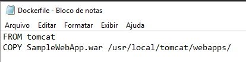
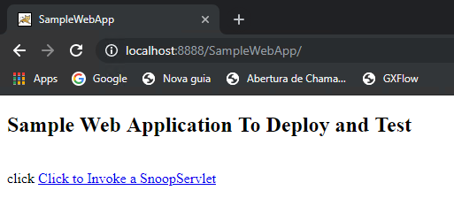

# Atividade 03

## Dockerfile

Nesta atividade vamos ver como utilizar o Dockerfile para fazermos o deploy de aplicações em contêineres Docker.

Inicialmente faça o download da aplicação de exemplo que iremos instalar. 

- [SampleWebApp.war](https://github.com/mshimao/Hands-On-Docker-com-Genexus/tree/master/docs/dockerfile/SampleWebApp.war)

Crie uma pasta no seu drive C: chamada HandsOnDocker e copie o arquivo war para esta pasta.

```bash
 O volume na unidade C não tem nome.
 O Número de Série do Volume é DA2B-B761

 Pasta de C:\HandsOnDocker

30/06/2019  11:14    <DIR>          .
30/06/2019  11:14    <DIR>          ..
30/06/2019  11:13             8.618 SampleWebApp.war
               1 arquivo(s)          8.618 bytes
               2 pasta(s)   12.963.368.960 bytes disponíveis
``` 

Abra o Bloco de Notas e crie um arquivo chamado Dockerfile, como o arquivo deve ser sem extensão, temos que tirar a extensão txt que o Bloco de Notas coloca.

```bash
C:\HandsOnDocker>ren Dockerfile.txt Dockerfile

C:\HandsOnDocker>dir
 O volume na unidade C não tem nome.
 O Número de Série do Volume é DA2B-B761

 Pasta de C:\HandsOnDocker

30/06/2019  11:19    <DIR>          .
30/06/2019  11:19    <DIR>          ..
30/06/2019  11:50                65 Dockerfile
30/06/2019  11:13             8.618 SampleWebApp.war
               2 arquivo(s)          8.683 bytes
               2 pasta(s)   12.898.099.200 bytes disponíveis

```

Abra o arquivo com o Bloco de Notas, agora vamos colocar os comandos para instalar a aplicação de exemplo no Tomcat. Digite os comandos abaixo:

```dockerfile
FROM tomcat
```
Esse comando informa que vamos usar a imagem com o nome tomcat como base da nossa nova imagem.


```dockerfile
COPY SampleWebApp.war /usr/local/tomcat/webapps/
```
Esse comando copia o arquivo SampleWebApp.war para a pasta /usr/local/tomcat/webapps/ da imagem. Como essa pasta é a pasta raiz das aplicações, o tomcat no momento da inicialização irá instalar a aplicação dentro dele.




Agora que temos a "receita" de como vai ser nossa nova imagem Docker, vamos criá-la. Para isso é necessário dar build para gerar a nova imagem, vamos usar o comando [docker build](https://docs.docker.com/engine/reference/commandline/build/).
Abra um tela de linha de comando e se posicione na pasta C:\HandsOnDocker e digite o comando `docker build -t tomcatsample .` para gerar a nova imagem.

```bash
C:\HandsOnDocker>docker build -t tomcatsample .
Sending build context to Docker daemon  11.26kB
Step 1/2 : FROM tomcat
 ---> 5377fd8533c3
Step 2/2 : COPY SampleWebApp.war /usr/local/tomcat/webapps/
 ---> d2f1799e252d
Successfully built d2f1799e252d
Successfully tagged tomcatsample:latest
SECURITY WARNING: You are building a Docker image from Windows against a non-Windows Docker host. All files and directories added to build context will have '-rwxr-xr-x' permissions. It is recommended to double check and reset permissions for sensitive files and directories.
```
Se listarmos a imagens que temos no Host Docker veremos que foi gerado uma nova imagem com o nome tomcatsample.

```bash
C:\HandsOnDocker>docker images
REPOSITORY          TAG                 IMAGE ID            CREATED             SIZE
tomcatsample        latest              d2f1799e252d        45 seconds ago      506MB
tomcat              latest              5377fd8533c3        2 weeks ago         506MB
```

O próximo passo é criar um container baseado na nossa nova imagem, executando o comando docker run. Execute o comando `docker run -p 8888:8080 tomcatsample` para subir um contêiner usando a imagem tomcatsample.

```bash
C:\HandsOnDocker>docker run -p 8888:8080 tomcatsample
30-Jun-2019 15:01:52.291 INFO [main] org.apache.catalina.startup.VersionLoggerListener.log Server version:        Apache Tomcat/8.5.42
30-Jun-2019 15:01:52.304 INFO [main] org.apache.catalina.startup.VersionLoggerListener.log Server built:          Jun 4 2019 20:29:04 UTC
30-Jun-2019 15:01:52.304 INFO [main] org.apache.catalina.startup.VersionLoggerListener.log Server number:         8.5.42.0
30-Jun-2019 15:01:52.304 INFO [main] org.apache.catalina.startup.VersionLoggerListener.log OS Name:               Linux
30-Jun-2019 15:01:52.304 INFO [main] org.apache.catalina.startup.VersionLoggerListener.log OS Version:            4.9.125-linuxkit
...
```

Abra um browser e digite a seguinte Url http://localhost:8888/SampleWebApp/.



E como podemos ver, a aplicação de exemplo foi instalada com sucesso.

Para seguirmos, liste os contêineres ativos e pare o contêiner do tomcatsample com o comando `docker stop`.

```bash
C:\HandsOnDocker>docker ps
CONTAINER ID        IMAGE               COMMAND             CREATED             STATUS              PORTS                    NAMES
7f0187966811        tomcatsample        "catalina.sh run"   10 minutes ago      Up 10 minutes       0.0.0.0:8888->8080/tcp   jovial_clarke

C:\HandsOnDocker>docker stop 7f0
7f0
```

Vimos como fazer o deploy de uma aplicação na mão, agora vamos ver como fazer isso com o Genexus (ou com o Visual Studio).

Deploy com Genexus: [Atividade 03b](03b-atividade.md)

Deploy com Visual Studio: [Atividade 03c](03c-atividade.md)
