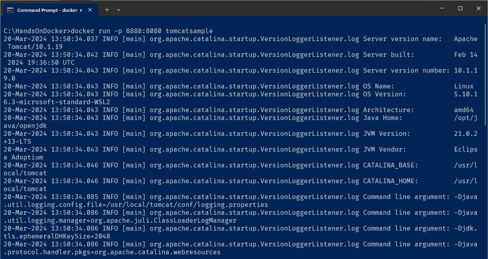
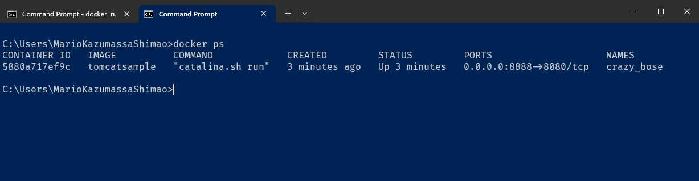
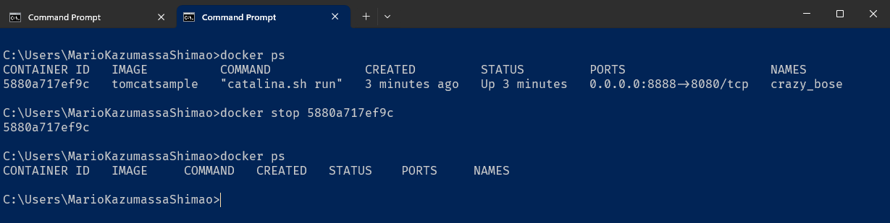

# Atividade 03

## Dockerfile

Nesta atividade vamos ver como utilizar o Dockerfile para fazermos o deploy de aplicações em contêineres Docker.

Um Dockerfile é um documento de texto que contém todas as instruções necessárias para criar uma imagem Docker. Com ele, é possível automatizar o processo de construção de imagens, especificando os comandos que um usuário executaria na linha de comando para montar a imagem desejada.

- [Documentação sobre o dockerfile](https://docs.docker.com/reference/dockerfile/)


#### Passo 1

Crie uma pasta no seu drive C: chamada HandsOnDocker e copie o arquivo SampleWebApp.war que está na pasta appjava para esta pasta.

```bash
C:\HandsOnDocker>dir
 Volume in drive C has no label.
 Volume Serial Number is FAAB-D7AE

 Directory of C:\HandsOnDocker

03/20/2024  10:33 AM    <DIR>          .
03/18/2024  02:52 PM             8,618 SampleWebApp.war
               1 File(s)          8,618 bytes
               1 Dir(s)  11,219,484,672 bytes free
``` 

Abra o Bloco de Notas e crie um arquivo chamado Dockerfile, como o arquivo deve ser sem extensão, temos que tirar a extensão txt que o Bloco de Notas coloca, para isso use o comando `ren Dockerfile.txt Dockerfile`.

```bash
C:\HandsOnDocker>ren Dockerfile.txt Dockerfile

C:\HandsOnDocker>dir
 Volume in drive C has no label.
 Volume Serial Number is FAAB-D7AE

 Directory of C:\HandsOnDocker

03/20/2024  10:36 AM    <DIR>          .
03/20/2024  10:35 AM                 0 Dockerfile
03/18/2024  02:52 PM             8,618 SampleWebApp.war
               2 File(s)          8,618 bytes
               1 Dir(s)  11,219,140,608 bytes free

```

Abra o arquivo com o Bloco de Notas, agora vamos colocar os comandos para instalar a aplicação de exemplo no Tomcat. Digite os comandos abaixo:

```dockerfile
FROM tomcat
```
Esse comando informa que vamos usar a imagem com o nome tomcat como base da nossa nova imagem.


```dockerfile
COPY SampleWebApp.war /usr/local/tomcat/webapps/
```
Esse comando copia o arquivo SampleWebApp.war para a pasta /usr/local/tomcat/webapps/ da imagem. Como essa pasta é a pasta raiz das aplicações, o tomcat no momento da inicialização irá instalar a aplicação dentro dele.


#### Passo 2

Agora que temos a "receita" de como vai ser nossa nova imagem Docker, vamos criá-la. Para isso é necessário dar build para gerar a nova imagem, vamos usar o comando [docker build](https://docs.docker.com/engine/reference/commandline/build/).
Abra um tela de linha de comando e se posicione na pasta C:\HandsOnDocker e digite o comando `docker build -t tomcatsample .` para gerar a nova imagem.

```bash
C:\HandsOnDocker>docker build -t tomcatsample .
[+] Building 0.0s (0/0)                                                                                  docker:default
2024/03/20 10:43:24 http2: server: error reading preface from client //./pipe/docker_engine: file has already been close[+] Building 0.5s (7/7) FINISHED                                                                         docker:default
 => [internal] load .dockerignore                                                                                  0.1s
 => => transferring context: 2B                                                                                    0.0s
 => [internal] load build definition from Dockerfile                                                               0.1s
 => => transferring dockerfile: 98B                                                                                0.0s
 => [internal] load metadata for docker.io/library/tomcat:latest                                                   0.0s
 => [internal] load build context                                                                                  0.1s
 => => transferring context: 38B                                                                                   0.0s
 => [1/2] FROM docker.io/library/tomcat                                                                            0.0s
 => CACHED [2/2] COPY SampleWebApp.war /usr/local/tomcat/webapps/                                                  0.0s
 => exporting to image                                                                                             0.1s
 => => exporting layers                                                                                            0.0s
 => => writing image sha256:4b2673e522278525d85e5b02c3e05d0bf890e8c8821ceab8174c2fb2d69ff001                       0.0s
 => => naming to docker.io/library/tomcatsample                                                                    0.0s

What's Next?
  View a summary of image vulnerabilities and recommendations → docker scout quickview

C:\HandsOnDocker>
```
Se listarmos a imagens que temos no Host Docker veremos que foi gerado uma nova imagem com o nome tomcatsample.
Para listar as imagens usar o comando `docker images`.

```bash
C:\HandsOnDocker>docker images
REPOSITORY     TAG       IMAGE ID       CREATED         SIZE
tomcatsample   latest    4b2673e52227   6 minutes ago   455MB
tomcat         latest    405afe63d576   13 days ago     455MB
```

#### Passo 3

O próximo passo é criar um container baseado na nossa nova imagem, executando o comando docker run. Execute o comando `docker run -p 8888:8080 tomcatsample` para subir um contêiner usando a imagem tomcatsample.
A porta padrão 8080 do tomcat está sendo mapeada para a porta 8888 para evitar conflitos, se você já tem algum programa utilizando essa porta, mude para uma outra disponível.



Abra um browser e digite a seguinte Url http://localhost:8888/SampleWebApp/.


E como podemos ver, a aplicação de exemplo foi instalada com sucesso.

#### Passo 4

Para seguirmos, liste os contêineres ativos com o comando `docker ps`.



Para parar o contêiner que está sendo executado utilizar o comando `docker stop`, informando o ID do container, neste caso `docker stop 5880a717ef9c`.



Vimos como fazer o deploy de uma aplicação na mão, agora vamos ver como fazer isso com o Genexus.

Próximo: [Atividade 04](04-atividade.md)