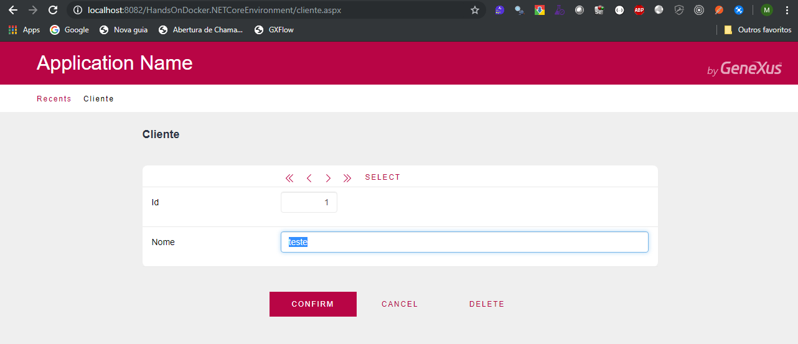

# Atividade 03b

## Genexus e Docker

Para essa ativade vamos utilizar o gerador .Net Core, então é necessário instalar os requisitos do gerador.

- [Requisitos do Gerador .Net Core](https://wiki.genexus.com/commwiki/servlet/wiki?38605,.Net+Core+Generator+Requirements)

Após a instalação do requisitos do gerador criar uma KB com o environment .NET Core.


Com a KB criada, fazer o download do arquivo xpz [HandsOnDocker.xpz](genexus/HandsOnDocker.xpz) e importar para a KB. Crie a base de dados SQL Server para os dados e rode a aplicação.



Agora temos que configurar o deploy para o Docker, para isso vamos seguir as instruções do documento [How to Deploy an Application to Docker](https://wiki.genexus.com/commwiki/servlet/wiki?36951,How+to+Deploy+an+Application+to+Docker).

O processo de deploy gera o seguinte output.

```bash
========== Deploy Application started ==========
Criando o projeto de implementação
Criando pacote
Analyzing files
Copiando arquivos de configura‡ao
Copiando arquivos est ticos
Copiando Themes
Copiando arquivos est ticos
Copiando recursos
Copiando arquivos padrao
Aplicando chaves seguras
Dependˆncias de publica‡ao ...
Aplicativo empacotado com sucesso em 'D:\Models\HandsOnDocker\NetCoreModel\Deploy\DOCKER\DeploymentUnit1\20190630153107'
linux
Sending build context to Docker daemon  6.358MB

Step 1/5 : FROM microsoft/dotnet:2.1.1-aspnetcore-runtime
2.1.1-aspnetcore-runtime: Pulling from microsoft/dotnet
683abbb4ea60: Pulling fs layer
c1cbc95d3469: Pulling fs layer
d79603d8f110: Pulling fs layer
6dd22a299b59: Pulling fs layer
6dd22a299b59: Waiting
d79603d8f110: Verifying Checksum
d79603d8f110: Download complete
c1cbc95d3469: Verifying Checksum
c1cbc95d3469: Download complete
683abbb4ea60: Verifying Checksum
683abbb4ea60: Download complete
683abbb4ea60: Pull complete
c1cbc95d3469: Pull complete
d79603d8f110: Pull complete
6dd22a299b59: Verifying Checksum
6dd22a299b59: Download complete
6dd22a299b59: Pull complete
Digest: sha256:95c91a6897a0d65416367f13965720967930181117cf4dcdbed140a2033cfa70
Status: Downloaded newer image for microsoft/dotnet:2.1.1-aspnetcore-runtime
---> cc35a08f0405
Step 2/5 : LABEL maintainer="mario <mario@example.com>"
---> Running in a744ff9d942a
Removing intermediate container a744ff9d942a
---> 83a8c9389ba9
Step 3/5 : WORKDIR /app
---> Running in b6d7c79850aa
Removing intermediate container b6d7c79850aa
---> c2f70b1b90ce
Step 4/5 : COPY ["DeploymentUnit1/20190630153107", "/app"]
---> 945910d4723a
Step 5/5 : ENTRYPOINT ["dotnet", "bin/GxNetCoreStartup.dll"]
---> Running in bc97c5bcb415
Removing intermediate container bc97c5bcb415
---> 656e08937d04
Successfully built 656e08937d04
Successfully tagged handsondocker.netcoreenvironment:latest
EXEC : SECURITY warning : You are building a Docker image from Windows against a non-Windows Docker host. All files and directories added to build context will have '-rwxr-xr-x' permissions. It is recommended to double check and reset permissions for sensitive files and directories. [C:\Program Files (x86)\GeneXus\GeneXus16\DeploymentTargets\Docker\deploy.msbuild]
Deploy Application Success
```
Note que foi usado uma imagem base da Microsoft que já tem o .Net Core Runtime instalado e depois foi copiado a aplicação.

Se listarmos as imagens veremos o contêiner gerado com a aplicação Genexus.

```bash
C:\HandsOnDocker>docker images
REPOSITORY                         TAG                        IMAGE ID            CREATED             SIZE
handsondocker.netcoreenvironment   latest                     656e08937d04        4 minutes ago       261MB
tomcatsample                       latest                     d2f1799e252d        4 hours ago         506MB
tomcat                             latest                     5377fd8533c3        2 weeks ago         506MB
microsoft/dotnet                   2.1.1-aspnetcore-runtime   cc35a08f0405        11 months ago       255MB
```

O interessante é que a imagem .Net Core é menor que a do Tomcat.

Para executarmos a aplicação devemos usar o comando `docker run` informando o nome da imagem e mapeando a porta.

```bash
C:\HandsOnDocker>docker run --rm -p 9999:80 handsondocker.netcoreenvironment
: Microsoft.AspNetCore.DataProtection.KeyManagement.XmlKeyManager[0]
      User profile is available. Using '/root/.aspnet/DataProtection-Keys' as key repository; keys will not be encrypted at rest.
info: Microsoft.AspNetCore.DataProtection.KeyManagement.XmlKeyManager[58]
      Creating key {53d30632-e0e3-4aad-90df-2d2ad99791b3} with creation date 2019-06-30 18:58:58Z, activation date 2019-06-30 18:58:58Z, and expiration date 2019-09-28 18:58:58Z.
warn: Microsoft.AspNetCore.DataProtection.KeyManagement.XmlKeyManager[35]
      No XML encryptor configured. Key {53d30632-e0e3-4aad-90df-2d2ad99791b3} may be persisted to storage in unencrypted form.
info: Microsoft.AspNetCore.DataProtection.Repositories.FileSystemXmlRepository[39]
      Writing data to file '/root/.aspnet/DataProtection-Keys/key-53d30632-e0e3-4aad-90df-2d2ad99791b3.xml'.
Hosting environment: Production
Content root path: /app
Now listening on: http://[::]:80
Application started. Press Ctrl+C to shut down.
```
Vamos acessar a aplicação abrindo o browser e digitando na Url http://localhost:9999/wplinicial.aspx.


Abra a transação e insira um novo registro na base de dados, e veja o que acontece.

Se a configuração do SQL do host não permitir conexões remotas pode surgir o erro abaixo no console do Docker.

```bash
fail: Microsoft.AspNetCore.Server.Kestrel[13]
      Connection id "0HLNTHL3BF486", Request id "0HLNTHL3BF486:00000001": An unhandled exception was thrown by the application.
System.Exception: GXApplication exception ---> System.Reflection.TargetInvocationException: Exception has been thrown by the target of an invocation. ---> GeneXus.Data.GxADODataException: Type:GeneXus.Data.GxADODataException.A network-related or instance-specific error occurred while establishing a connection to SQL Server. The server was not found or was not accessible. Verify that the instance name is correct and that SQL Server is configured to allow remote connections. 
```
Um dos motivos pode ser porque o SQL Server não está configurado para receber conexões remotas via IP. Para configurar isso seguir as indicações do documento abaixo:

- [Configurando o SQL Server para Acesso Remoto](http://www.regilan.com.br/wp-content/uploads/2015/11/ROTEIRO-Configurando-o-SQL-Server-para-Acesso-Remoto.pdf)

Se mesmo com essa configuração o erro persistir, edite a propriedade Server Name do Data Store colocando **host.docker.internal** no lugar do IP ou nome da máquina. Após isso dê build e faça novamente o deploy para o Docker pela opção Deploy Application do menu Build.

Próximo: [Atividade 04](04-atividade.md)