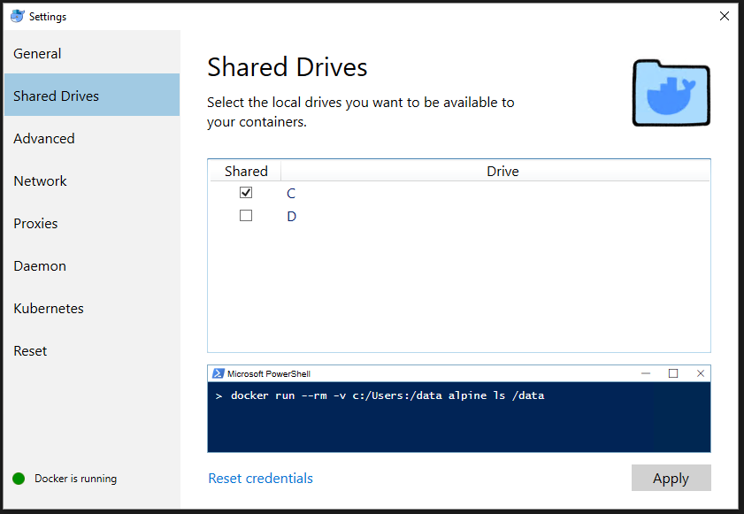

# Atividade 04

## Docker Volume

### Acessando uma pasta do Host

Para mapear uma pasta do Windows para uma pasta de um contêiner do Docker inicialmente é necessário habilitar o Shared Drive no Docker Desktop.
Na opção Shared Drive, selecione o drive C e clique em Apply. Será solicitado a senha do administrador para liberar o acesso do Docker Host ao drive C.



Agora vamos executar o comando `docker run` agora com o parâmetro `-v` para mapear a pasta C:\HandsOnDocker do Windows para a pasta /data do Linux Alpine, também será passado o comando `ls` para listar os arquivos da pasta data.

```bash
C:\HandsOnDocker>docker run -v c:/HandsOnDocker:/data alpine ls /data
Unable to find image 'alpine:latest' locally
latest: Pulling from library/alpine
921b31ab772b: Pull complete
Digest: sha256:ca1c944a4f8486a153024d9965aafbe24f5723c1d5c02f4964c045a16d19dc54
Status: Downloaded newer image for alpine:latest
Dockerfile
SampleWebApp.war
```
Vemos que o Docker mapeou a pasta corretamente e mostrou o conteúdo.

Agora vamos executar criar o contêiner usando o parâmetro `-it` para podemos executar comandos no bash do Linux. Após o contêiner subir execute o comando ls para listar as pastas.

```bash
C:\HandsOnDocker>docker run -it -v c:/HandsOnDocker:/data alpine
/ # ls
bin    dev    home   media  opt    root   sbin   sys    usr
data   etc    lib    mnt    proc   run    srv    tmp    var
/ #
```

Execute o comando `cd data` para entrar na pasta. Agora vamos criar uma aquivo texto usando a instrução `cat > teste.txt`. Digite alguma coisa e depois aperte CTRL + D para sair do arquivo. Execute o comando `ls` para listar os arquivos.

```bash
/ # cd data
/data # cat > teste.txt
texto de teste
/data # ls
Dockerfile        SampleWebApp.war  teste.txt
/data #
```

Verifique se na pasta C:\HandsOnDocker do Windows aparece o arquivo teste.txt.

### Volumes

Agora vamos trabalhar com volumes de forma diferente, vamos criar um volume usando o comando `docker volume create` como o nome de dados.

```bash
C:\HandsOnDocker>docker volume create dados
dados

C:\HandsOnDocker>docker volume ls
DRIVER              VOLUME NAME
local               dados
```
Crie agora um contêiner usando esse volume, para isso use o parâmetro `-v dados:/var/dados`, esse parâmetro mapea o volume dados para a pasta /var/dados do contêiner.

```bash
C:\HandsOnDocker>docker run -it --name servidor -v dados:/var/dados alpine
/ # cd var
/var # ls
cache  dados  empty  lib    local  lock   log    opt    run    spool  tmp
/var #
```

Agora vá até a pasta /var/dados e crie uma arquivo texto chamado teste.txt usando o comando `cat > teste.txt` e CRTL + D para sair do arquivo.

```bash
/var/dados # ls
teste.txt
```

Abra outra tela de linha de comando, vamos criar um outro contêiner usando o volume dados, dando um nome diferente do anterior. Verifique se o arquivo criado anteriormente está lá.

```bash
C:\HandsOnDocker>docker run -it --name servidor2 -v dados:/var/dados alpine
```

Crie um outro arquivo na pasta dados e vá para a tela do contêiner anterior e liste o conteúdo da pasta, você verá que o arquivo criado aparece, ou seja os dois contêineres estão compartilhando o mesmo volume. 

```bash
/var/dados # ls
teste.txt   teste2.txt
/var/dados #
```

Agora conseguimos persistir informações mesmo que o contêiner pare ou seja apagado, podemos usar o volume para armazenar as bases de dados de um servidor de banco de dados ou outros dados relevantes.


### Atividade Extra

Se você quiser testar isso com o MySQL siga os passos do post abaixo.

- [Blog da Alura -Criando volumes com Docker](https://blog.alura.com.br/criando-volumes-com-docker/)

Próximo: [Atividade 05](05-atividade.md)