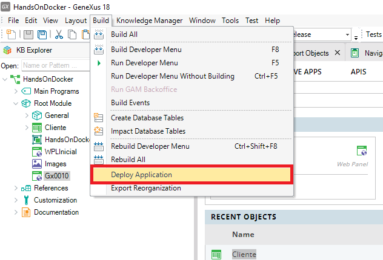
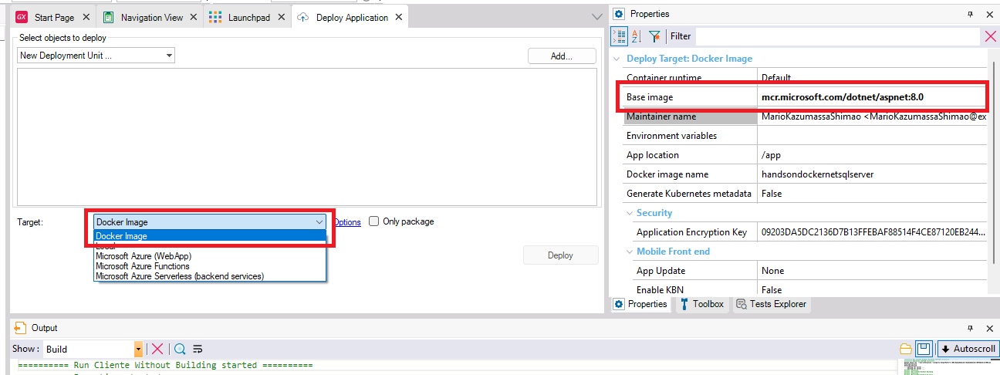
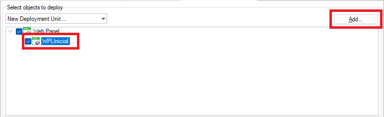
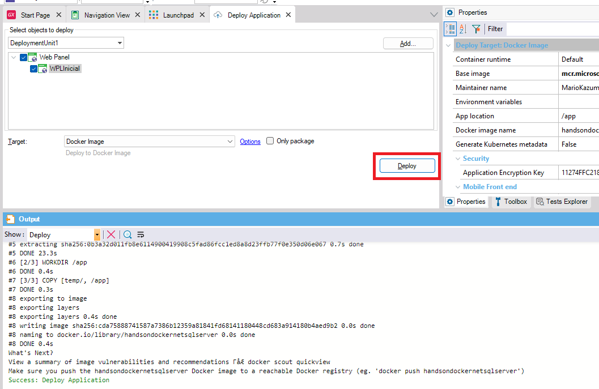
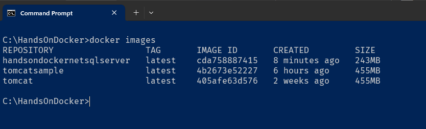
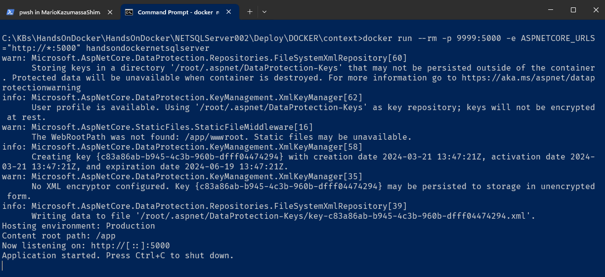
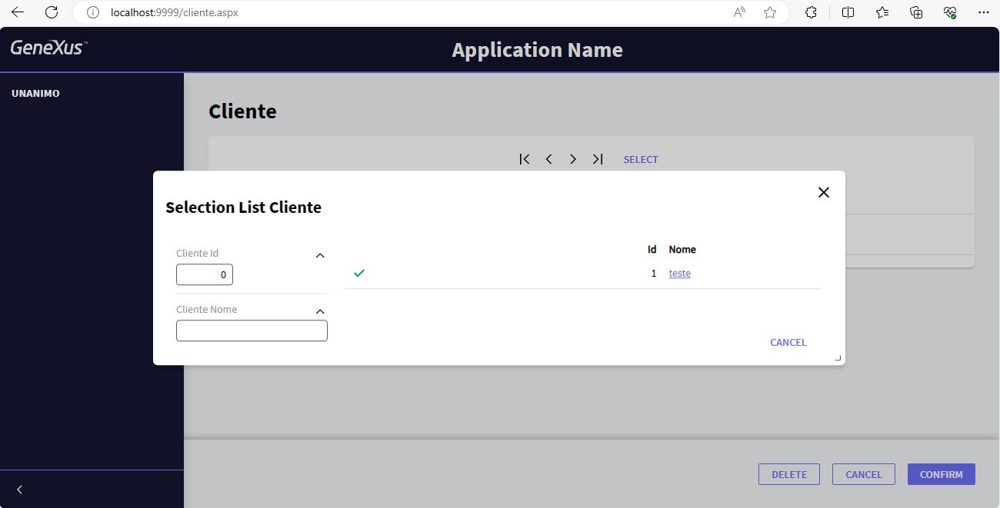

# Atividade 04

## Genexus e Docker

Agora temos que configurar o deploy para o Docker, para isso vamos seguir as instruções do documento [How to Deploy an Application to Docker](https://wiki.genexus.com/commwiki/servlet/wiki?36951,How+to+Deploy+an+Application+to+Docker).

#### Passo 1

Abrir no Genexus a kb anteriormente criada.
Abrir o Application Deployment tool.



#### Passo 2

Selecionar a opção "Docker Image" no combo Target. Note que a imagem base para a geração da imagem é "mcr.microsoft.com/dotnet/aspnet:8.0", que já contém o .Net Core 8.0 Runtime instalado. 

Para versões anteriores do Genexus, a imagem base pode ser outra.



#### Passo 3

Clicar em "Add" e selecionar o web panel "WPLInicial".



#### Passo 4

Clicar no botão "Deploy" para gerar a imagem.



Se listarmos as imagens, usando o comando `docker images` veremos o contêiner gerado com a aplicação Genexus com o nome "handsondockernetsqlserver".



O interessante é que a imagem .Net Core é menor que a do Tomcat.

#### Passo 5

Para executarmos a aplicação devemos usar o comando `docker run --rm -p 9999:5000 -e ASPNETCORE_URLS="http://*:5000" handsondockernetsqlserver` informando o nome da imagem e mapeando a porta.



#### Passo 6

Vamos acessar a aplicação abrindo o browser e digitando na Url http://localhost:9999/wplinicial.aspx.




Abra a transação e insira um novo registro na base de dados, e veja o que acontece.

Se a configuração do SQL do host não permitir conexões remotas pode surgir o erro abaixo no console do Docker.

```bash
fail: Microsoft.AspNetCore.Server.Kestrel[13]
      Connection id "0HLNTHL3BF486", Request id "0HLNTHL3BF486:00000001": An unhandled exception was thrown by the application.
System.Exception: GXApplication exception ---> System.Reflection.TargetInvocationException: Exception has been thrown by the target of an invocation. ---> GeneXus.Data.GxADODataException: Type:GeneXus.Data.GxADODataException.A network-related or instance-specific error occurred while establishing a connection to SQL Server. The server was not found or was not accessible. Verify that the instance name is correct and that SQL Server is configured to allow remote connections. 
```
Um dos motivos pode ser porque o SQL Server não está configurado para receber conexões remotas via IP. Para configurar isso seguir as indicações do documento abaixo:

- [Configurando o SQL Server para Acesso Remoto](pdfs/Configurando-o-SQL-Server-para-Acesso-Remoto.pdf)

Se mesmo com essa configuração o erro persistir, edite a propriedade Server Name do Data Store no Genexus colocando **host.docker.internal** no lugar do IP. Após isso dê build e faça novamente o deploy para o Docker pela opção Deploy Application do menu Build.

Para alterar a configuração da conexão do banco de dados da aplicação é possível utilizar variáveis de ambiente que alteram os dados configurados no Genexus.

- [Configuração de variáveis de ambiente no Docker](https://wiki.genexus.com/commwiki/wiki?53336,Application+Configuration+using+Environment+Variables+in+.NET+and+Java)

Próximo: [Atividade 05](05-atividade.md)