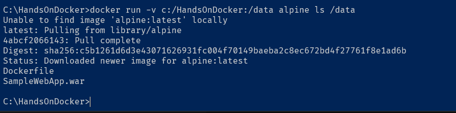
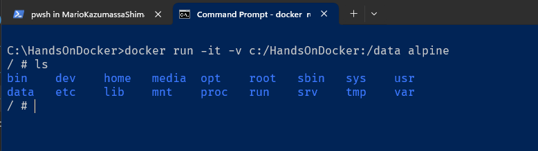
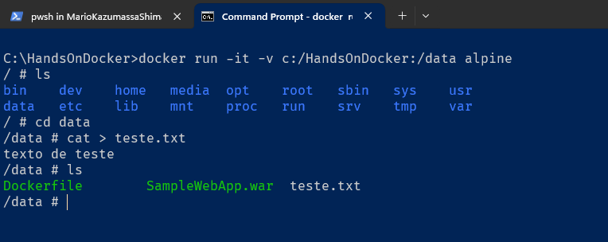
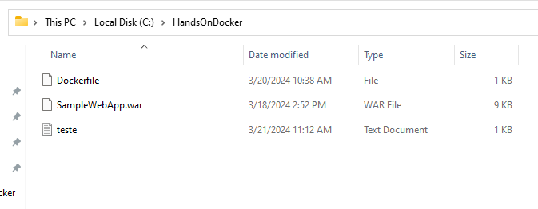

# Atividade 04

## Docker Volume

### Acessando uma pasta do Host

#### Passo 1

Vamos executar o comando `docker run -v c:/HandsOnDocker:/data alpine ls /data`, o parâmetro `-v` mapea a pasta C:\HandsOnDocker do Windows para a pasta /data do Linux Alpine, está sendo passado o comando `ls` para listar os arquivos da pasta data.



Vemos que o Docker mapeou a pasta corretamente e mostrou o conteúdo.

#### Passo 2

Agora vamos executar criar o contêiner usando o parâmetro `-it` para podermos executar comandos no bash do Linux. Após o contêiner subir execute o comando ls para listar as pastas.

```bash
docker run -it -v c:/HandsOnDocker:/data alpine
```



#### Passo 3

Execute o comando `cd data` para entrar na pasta data. Agora vamos criar uma aquivo texto usando a instrução `cat > teste.txt`. Digite alguma coisa, dê enter e depois aperte CTRL + D para sair do arquivo. Execute o comando `ls` para listar os arquivos.



Verifique se na pasta C:\HandsOnDocker do Windows aparece o arquivo teste.txt.



### Volumes

Agora vamos trabalhar com volumes de forma diferente, vamos criar um volume usando o comando `docker volume create` como o nome de dados.

```bash
C:\HandsOnDocker>docker volume create dados
dados

C:\HandsOnDocker>docker volume ls
DRIVER              VOLUME NAME
local               dados
```
Crie agora um contêiner usando esse volume, para isso use o parâmetro `-v dados:/var/dados`, esse parâmetro mapea o volume dados para a pasta /var/dados do contêiner.

```bash
C:\HandsOnDocker>docker run -it --name servidor -v dados:/var/dados alpine
/ # cd var
/var # ls
cache  dados  empty  lib    local  lock   log    opt    run    spool  tmp
/var #
```

Agora vá até a pasta /var/dados e crie uma arquivo texto chamado teste.txt usando o comando `cat > teste.txt` e CRTL + D para sair do arquivo.

```bash
/var/dados # ls
teste.txt
```

Abra outra tela de linha de comando, vamos criar um outro contêiner usando o volume dados, dando um nome diferente do anterior. Verifique se o arquivo criado anteriormente está lá.

```bash
C:\HandsOnDocker>docker run -it --name servidor2 -v dados:/var/dados alpine
```

Crie um outro arquivo na pasta dados e vá para a tela do contêiner anterior e liste o conteúdo da pasta, você verá que o arquivo criado aparece, ou seja os dois contêineres estão compartilhando o mesmo volume. 

```bash
/var/dados # ls
teste.txt   teste2.txt
/var/dados #
```

Agora conseguimos persistir informações mesmo que o contêiner pare ou seja apagado, podemos usar o volume para armazenar as bases de dados de um servidor de banco de dados ou outros dados relevantes.

## Documentação do Docker Volume

Para maiores detalhes sobre o Docker Volume, consultar a documentação abaixo:

- [Documentação do Docker Volume](https://docs.docker.com/storage/volumes/)

Próximo: [Atividade 06](06-atividade.md)