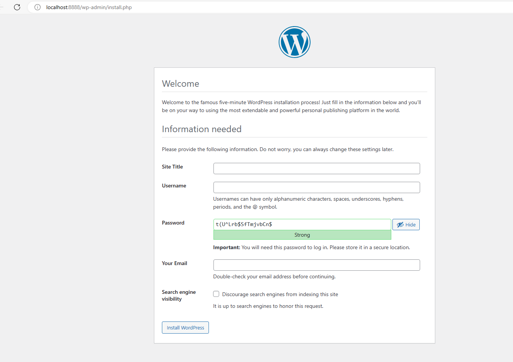

# Atividade 05

## Docker Compose

### Criando um arquivo docker-compose.yml

Crie na pasta C:\HandsOnDocker um arquivo com o nome docker-compose.yml e digite o conteúdo abaixo.

Dica: o arquivo YAML segue algumas regras de formatação que podem ser vistas neste post da [Wikipedia - YAML](https://pt.wikipedia.org/wiki/YAML).

Para validar o arquivo YAML use o validador online [YAML Validator](https://codebeautify.org/yaml-validator).

```docker-compose
version: '3.1'

services:

  wordpress:
    image: wordpress
    restart: always
    ports:
      - 8080:80
    environment:
      WORDPRESS_DB_HOST: db
      WORDPRESS_DB_USER: exampleuser
      WORDPRESS_DB_PASSWORD: examplepass
      WORDPRESS_DB_NAME: exampledb

  db:
    image: mysql:5.7
    restart: always
    environment:
      MYSQL_DATABASE: exampledb
      MYSQL_USER: exampleuser
      MYSQL_PASSWORD: examplepass
      MYSQL_RANDOM_ROOT_PASSWORD: '1'
```

Abra uma tela de linha de comando e vá até a pasta C:\HandsOnDocker, vamos rodar o comando `docker-compose up` que irá executar o arquivo docker-compose.yml.


```bash
C:\HandsOnDocker>docker-compose up
Creating network "handsondocker_default" with the default driver
Pulling wordpress (wordpress:)...
latest: Pulling from library/wordpress
fc7181108d40: Already exists
0e65236fc68a: Pull complete
657b7ad8209d: Pull complete
fe9abd6f2547: Pull complete
3f3b3b58af14: Pull complete
6c87b44c0319: Pull complete
879171658515: Pull complete
29c3b2e8a58a: Pull complete
c3a25239431e: Pull complete
f297f66a8e1d: Pull complete
702f5011adeb: Pull complete
ea31bc27c1fb: Pull complete
ad44f5a21cda: Pull complete
2bacc84b4546: Pull complete
02be7a597123: Pull complete
9dddbf10a11a: Pull complete
9beb0c6b7213: Pull complete
93811cb0ca12: Pull complete
b8edba923947: Pull complete
Creating handsondocker_db_1        ... done
Creating handsondocker_wordpress_1 ... done
Attaching to handsondocker_db_1, handsondocker_wordpress_1
db_1         | Initializing database
db_1         | 2019-07-02T00:10:55.155755Z 0 [Warning] TIMESTAMP with implicit DEFAULT value is deprecated. Please use --explicit_defaults_for_timestamp server option (see documentation for more details).
db_1         | 2019-07-02T00:10:55.985803Z 0 [Warning] InnoDB: New log files created, LSN=45790
db_1         | 2019-07-02T00:10:56.056591Z 0 [Warning] InnoDB: Creating foreign key constraint system tables.
db_1         | 2019-07-02T00:10:56.146837Z 0 [Warning] No existing UUID has been found, so we assume that this is the first time that this server has been started. Generating a new UUID: dcc78a69-9c5d-11e9-bca9-0242ac140002.
...

```

Após o processamento parar, abra um browser e acesse a Url http://localhost:8080, o site do Wordpress estará pronto para ser inicializado.



Implantação de uma aplicação Genexus com Docker Compose: [Atividade 05b](05b-atividade.md).

Usando o Docker Compose com o Visual Studio: [Atividade 05b](05c-atividade.md).


