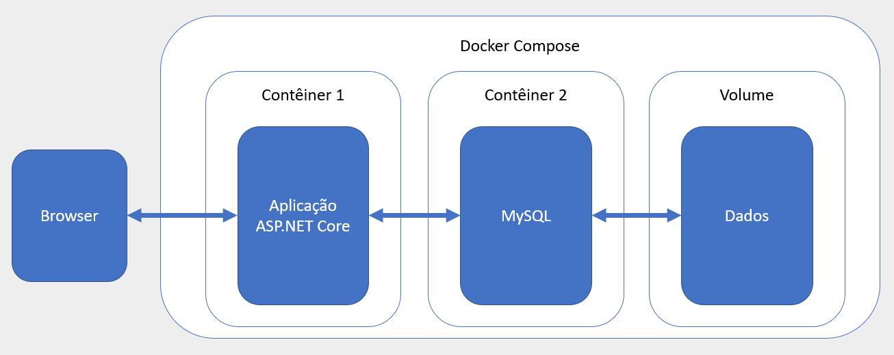

# Atividade 05

## Docker Compose

### Implantação de uma aplicação com Docker Compose

Nesta atividade tente criar uma infra estrutura para executar uma aplicação .Net Core acessando um servidor MySQL com o banco de dados num Volume Docker.




Baixe o HeidiSQL para poder realizar querys no MySQL.

- [Download HeidiSQL](https://www.heidisql.com/download.php)

Inicialmente crie um volume para persistir os dados do MySQL e configure um contêiner para usar esse volume seguindo as instruções do post (Criando Volumes com Docker)[https://blog.alura.com.br/criando-volumes-com-docker/].

Use a imagem do MySQL que já foi baixada na atividade anterior para subir o contêiner:

```bash
mysql:5.7
```
Também será necessário configurar a senha do root informando o valor da variável MYSQL_ROOT_PASSWORD no parâmetro -e (variáveis de ambientes do contêiner).

``` bash
-e MYSQL_ROOT_PASSWORD=password 
```

Depois que o contêiner estiver ativo, conecte com o HeidiSQL para verificar se o MySQL está funcionando adequadamente.

Agora baixe a solução abaixo para servir de base para a atividade.

- [Exemplos de utilização do Dapper em ASP.NET Core 2.0 e utilizando uma base MySQL](https://github.com/renatogroffe/Dapper-DotNetCore2-MySQL)

Crie a tabela Estados no MySQL usando o script Script-Estados.sql da pasta scripts. 

Execute a aplicação para verificar se está rodando.

Agora que a aplicação está rodando, crie um Dockerfile para gerar uma imagem com a aplicação.

Depois da imagem criada edite o aquivo docker-compose.yml para refletir a infraestrutura desejada, com a aplicação ASP.Net Core, o servidor MySQL e o volume.

- [Documentação do Docker Compose - volumes](https://docs.docker.com/compose/compose-file/#volumes)

Um ponto importante é a configuração da conexão da aplicação com o banco de dados, que deve ser configurada usando variáveis de ambiente. Veja no link abaixo como fazer isso e coloque as configurações necessárias no docker compose file.

- [ASP.NET Core and Docker Environment Variables](https://www.scottbrady91.com/Docker/ASPNET-Core-and-Docker-Environment-Variables)

Com o arquivo docker-compose.yml editado, execute o comando `docker-compose up` e veja se a aplicação executa corretamente.

