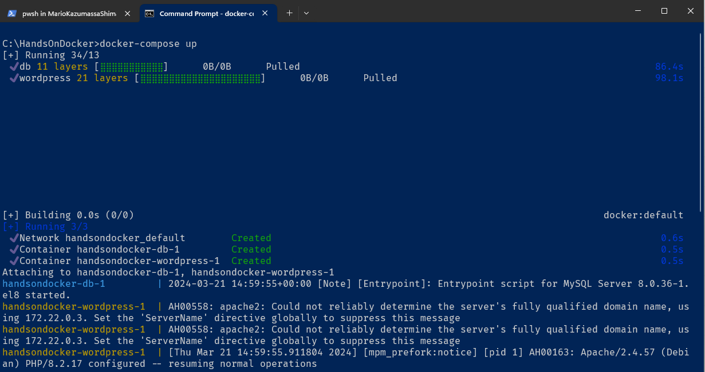
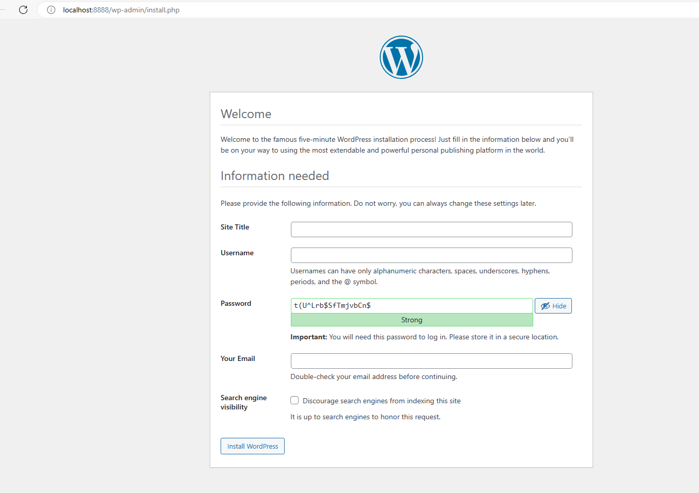

# Atividade 06

## Docker Compose

O Docker Compose é uma ferramenta poderosa para gerenciar contêineres em ambientes de desenvolvimento, testes automatizados ou cenários de execução em um único host.
- O Docker Compose é declarado em um arquivo chamado "docker-compose.yml".
- Ele permite configurar e gerenciar múltiplos contêineres em um único arquivo YAML.
- Com o Docker Compose, você pode definir a estrutura de seus serviços, suas dependências e configurações.
Por exemplo, se você tiver um aplicativo web com um servidor e um banco de dados, o Docker Compose permite definir ambos os serviços e suas interações em um único arquivo.

Abaixo segue um exemplo de uma aplicação com vários containeres sendo executados no docker, para executar esses conteineres de forma sincronizada, é utilizado o Docker Compose.


### Criando um arquivo docker-compose.yml

#### Passo 1

Crie na pasta C:\HandsOnDocker um arquivo com o nome "docker-compose.yml" e digite o conteúdo abaixo.

Dica: o arquivo YAML segue algumas regras de formatação que podem ser vistas neste post da [Wikipedia - YAML](https://pt.wikipedia.org/wiki/YAML).

Para validar o arquivo YAML use o validador online [YAML Validator](https://codebeautify.org/yaml-validator), ou usar um editor como o VS Code com a extensão para Docker instalado, para editar o arquivo YAML.

```docker-compose
version: '3.1'

services:

  wordpress:
    image: wordpress
    restart: always
    ports:
      - 8888:80
    environment:
      WORDPRESS_DB_HOST: db
      WORDPRESS_DB_USER: exampleuser
      WORDPRESS_DB_PASSWORD: examplepass
      WORDPRESS_DB_NAME: exampledb
    volumes:
      - wordpress:/var/www/html

  db:
    image: mysql:8.0
    restart: always
    environment:
      MYSQL_DATABASE: exampledb
      MYSQL_USER: exampleuser
      MYSQL_PASSWORD: examplepass
      MYSQL_RANDOM_ROOT_PASSWORD: '1'
    volumes:
      - db:/var/lib/mysql

volumes:
  wordpress:
  db:
```
#### Passo 2

Abra uma tela de linha de comando e vá até a pasta C:\HandsOnDocker, vamos rodar o comando `docker-compose up` que irá executar o arquivo docker-compose.yml.



#### Passo 3

Após o processamento parar, abra um browser e acesse a Url http://localhost:8888, o site do Wordpress estará pronto para ser inicializado.



Preencha os campos e clique em "Install WordPress", copie o valor do campo do password para logar posteriormente.

Após o setup, faça o login.


#### Passo 4

Vamos parar os conteineres e subir novamente para ver 

## Documentação do Docker Compose

Para maiores detalhes sobre o Docker Compose, consultar a documentação abaixo:

- [Documentação do Docker Compose](https://docs.docker.com/compose/)

Próximo: [Atividade 07](07-atividade.md)
